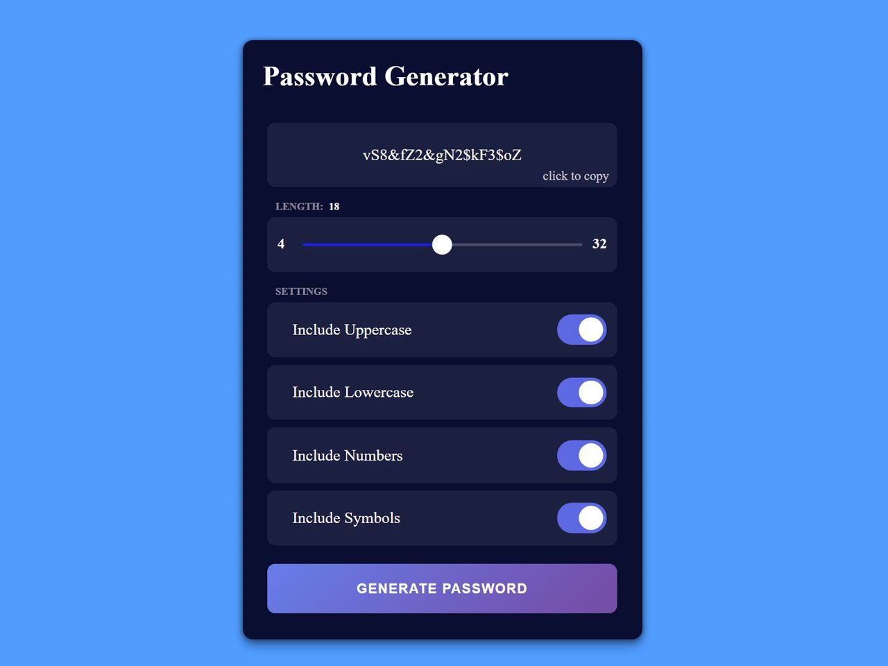

# Password Generator🔑

## 🔗Technologies Used :

• HTML

• CSS

• JavaScript

*🔗A simple and secure password generator built with JavaScript. This application allows users to create strong passwords based on their preferences, including character types and length*

## 🔗 Features :

**Customizable Password Options: Users can choose from:**

  1. Uppercase letters

  2.  Lowercase letters

  3.  Numbers

  4. Symbols

####  Adjustable Password Length: Users can specify the desired length of the generated password.

####  Copy to Clipboard: Easily copy the generated password to your clipboard for convenient use.

## [Live Demo](https://password-generator-two-omega-77.vercel.app/)

*mehranmohamdi1311@gmail.com*